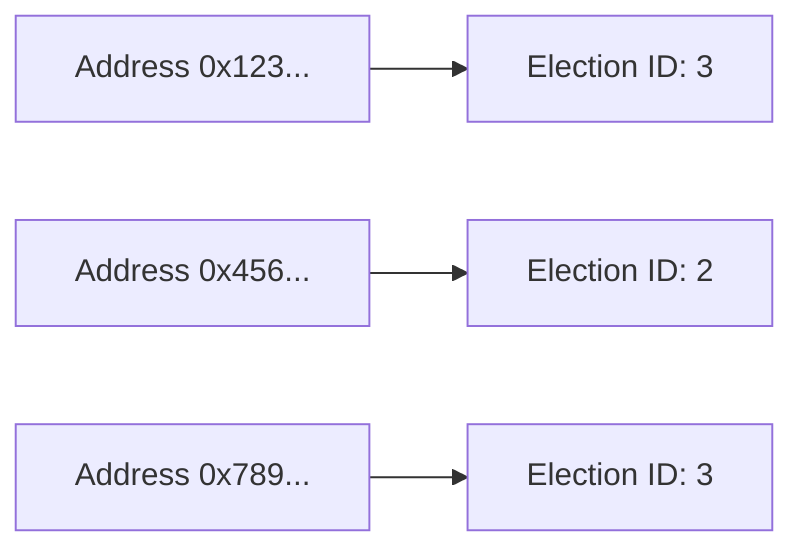
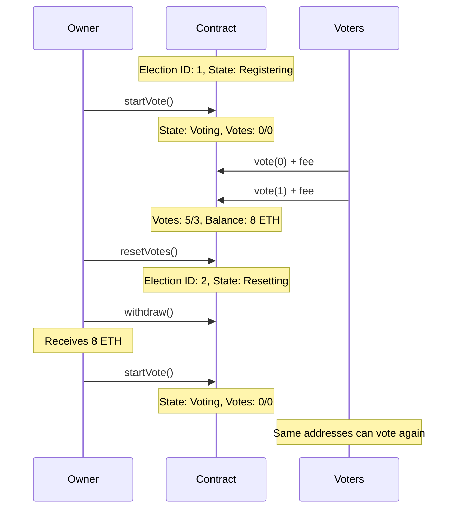

The Smart Voting Contract supports multiple sequential elections through an election ID system. This enables the contract to be reused indefinitely while maintaining vote integrity across different election cycles.

## Election ID Counter

Each election is identified by a unique, incrementing counter stored in `s_electionId`:

```solidity
uint256 private s_electionId;
```

### Initialization

The election ID starts at `1` when the contract is deployed:

```solidity
constructor(uint256 entryFee) {
    i_owner = msg.sender;
    i_entryFee = entryFee;
    s_electionId = 1;
    s_workFlowStation = WorkFlowStation.Registering;
}
```

<Note>
You can query the current election ID at any time by calling `getElectionId()`.
</Note>

### Incrementing the Counter

The election ID increments when the owner calls `resetVotes()` after a voting period concludes:

```solidity
function resetVotes() public onlyOwner {
    if (s_workFlowStation != WorkFlowStation.Voting) {
        revert MemberVote__WrongWorkflowStation();
    }
    s_workFlowStation = WorkFlowStation.Resetting;
    s_electionId++;
}
```

This increment is crucial for enabling voters to participate in future elections even if they voted in previous ones.

## Vote Reset Mechanism

Between elections, the contract resets vote counts and clears the voter list while preserving the historical voting records.

### Resetting Vote Counts

When the owner calls `startVote()` to begin a new election, all vote counts return to zero:

```solidity
function startVote() public onlyOwner {
    s_workFlowStation = WorkFlowStation.Voting;
    optionAVotes = 0;
    optionBVotes = 0;
    voters = new address[](0);
}
```

<Accordion title="What gets reset?">
- `optionAVotes`: Reset to 0
- `optionBVotes`: Reset to 0
- `voters`: Cleared to an empty array
- `s_workFlowStation`: Changed to `Voting`

**Note**: The `s_addressToVoted` mapping is NOT cleared. Instead, it maintains historical records of which election each address voted in.
</Accordion>

### The Voters Array

The `voters` array tracks participants in the current election:

```solidity
address[] private voters;
```

Each time someone votes, their address is added:

```solidity
voters.push(voter);
```

This array is cleared at the start of each new election, ensuring it only contains participants from the current cycle.

## Address-to-Election Mapping

The core mechanism for managing election cycles is the `s_addressToVoted` mapping:

```solidity
mapping(address => uint256) private s_addressToVoted;
```

### How It Works

This mapping stores the election ID in which each address last voted:



### Recording Votes

When you cast a vote, the contract records the current election ID against your address:

```solidity
s_addressToVoted[voter] = s_electionId;
```

### Preventing Double-Voting

The contract compares your last voted election ID with the current one:

```solidity
if (s_addressToVoted[voter] == s_electionId) {
    revert MemberVote__AlreadyVoted();
}
```

<CodeGroup>
```solidity Scenario 1: First Vote in Election 1
// Current election ID: 1
// s_addressToVoted[voter]: 0 (never voted)
// Result: Vote allowed
```

```solidity Scenario 2: Second Vote in Election 1
// Current election ID: 1
// s_addressToVoted[voter]: 1 (already voted)
// Result: MemberVote__AlreadyVoted error
```

```solidity Scenario 3: Vote in Election 2
// Current election ID: 2 (after resetVotes)
// s_addressToVoted[voter]: 1 (voted in election 1)
// Result: Vote allowed
```
</CodeGroup>

### Checking Vote History

You can check which election an address voted in using the `addressVoted()` function:

```solidity
function addressVoted(address voter) public view returns (uint256) {
    return s_addressToVoted[voter];
}
```

This returns:
- `0` if the address has never voted
- The election ID if the address has voted

<Note>
The mapping persists across all elections, creating a permanent record of participation history.
</Note>

## Fee Collection and Withdrawal

As votes are cast with entry fees, the contract accumulates ETH. The owner can withdraw these collected fees at any time.

### The withdraw() Function

The owner can claim all accumulated fees using the `withdraw()` function:

```solidity
function withdraw() public onlyOwner {
    (bool success,) = i_owner.call{value: address(this).balance}("");
    if (!success) {
        revert MemberVote__WithdrawFailed();
    }
}
```

<Warning>
Only the contract owner can withdraw funds. Attempting to call this function from any other address will revert with `MemberVote__NotOwner`.
</Warning>

### How Fees Accumulate

Each vote adds to the contract balance:

1. Voter calls `vote()` with `msg.value >= i_entryFee`
2. The ETH is transferred to the contract
3. The contract balance increases by `msg.value`
4. Vote counts are updated

### Withdrawal Behavior

- Transfers the **entire** contract balance to the owner
- Uses low-level `call` for maximum compatibility
- Reverts with `MemberVote__WithdrawFailed` if the transfer fails
- Can be called at any time, regardless of workflow state

<Accordion title="Can the owner withdraw during active voting?">
Yes. The `withdraw()` function has no workflow state restrictions. The owner can withdraw accumulated fees even while voting is ongoing. However, this doesn't affect the voting process - members can continue to vote and their fees will accumulate for future withdrawal.
</Accordion>

## Election Lifecycle Example



<Note>
Because the election ID increments with each cycle, addresses that voted in election 1 can vote again in election 2, 3, and so on indefinitely.
</Note>