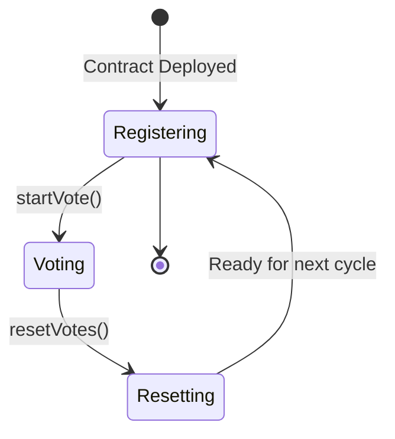

The Smart Voting Contract operates through a three-phase workflow controlled by the contract owner. This workflow ensures proper sequencing of registration, voting, and reset operations.

## WorkFlowStation Enum

The contract defines three distinct workflow states using the `WorkFlowStation` enum:

```solidity
enum WorkFlowStation {
    Registering,
    Voting,
    Resetting
}
```

### Registering Phase

The contract begins in the `Registering` state upon deployment. During this phase:
- No votes can be cast
- The owner can prepare for the next election
- The contract is waiting for the owner to start the voting process

<Note>
The contract is initialized in the `Registering` state in the constructor at src/MemberVote.sol:36.
</Note>

### Voting Phase

This is the active voting period where members can cast their votes. The owner transitions to this phase by calling `startVote()`.

### Resetting Phase

After voting concludes, the owner can move to the `Resetting` phase to finalize the election and prepare for the next cycle.

## State Transitions

Only the contract owner can transition between workflow states. These transitions are controlled by two key functions:

### Starting the Vote

The `startVote()` function transitions from `Registering` to `Voting` and initializes the election:

```solidity
function startVote() public onlyOwner {
    s_workFlowStation = WorkFlowStation.Voting;
    optionAVotes = 0;
    optionBVotes = 0;
    voters = new address[](0);
}
```

<Accordion title="What happens when startVote() is called?">
1. The workflow station changes to `Voting`
2. Vote counts for both options reset to zero
3. The voters array is cleared for the new election
4. Members can now call the `vote()` function
</Accordion>

### Resetting the Votes

The `resetVotes()` function transitions from `Voting` to `Resetting` and increments the election cycle:

```solidity
function resetVotes() public onlyOwner {
    if (s_workFlowStation != WorkFlowStation.Voting) {
        revert MemberVote__WrongWorkflowStation();
    }
    s_workFlowStation = WorkFlowStation.Resetting;
    s_electionId++;
}
```

<Warning>
The `resetVotes()` function can only be called during the `Voting` phase. Attempting to call it during other phases will revert with `MemberVote__WrongWorkflowStation`.
</Warning>

## Owner-Only Control

All state transitions require owner authorization through the `onlyOwner` modifier:

```solidity
modifier onlyOwner() {
    if (msg.sender != i_owner) {
        revert MemberVote__NotOwner();
    }
    _;
}
```

If a non-owner attempts to call `startVote()` or `resetVotes()`, the transaction will revert with the `MemberVote__NotOwner` error.

## Workflow Diagram



<Note>
You can check the current workflow state by calling `getWorkflowStation()`, which returns the current `WorkFlowStation` enum value.
</Note>